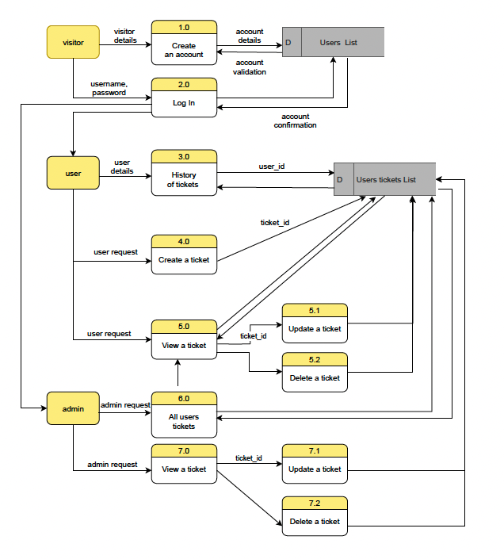
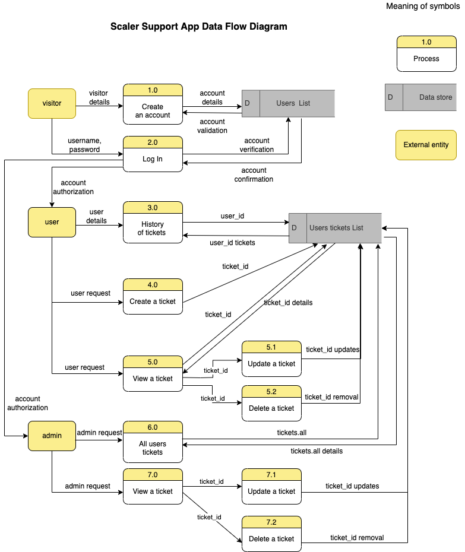
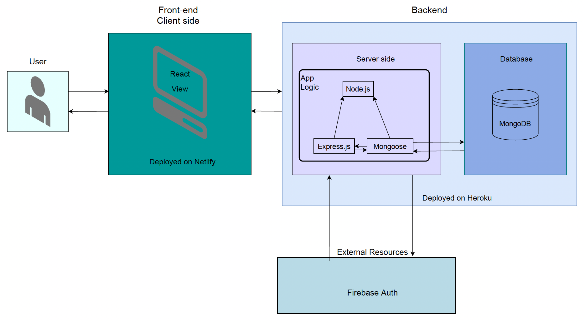
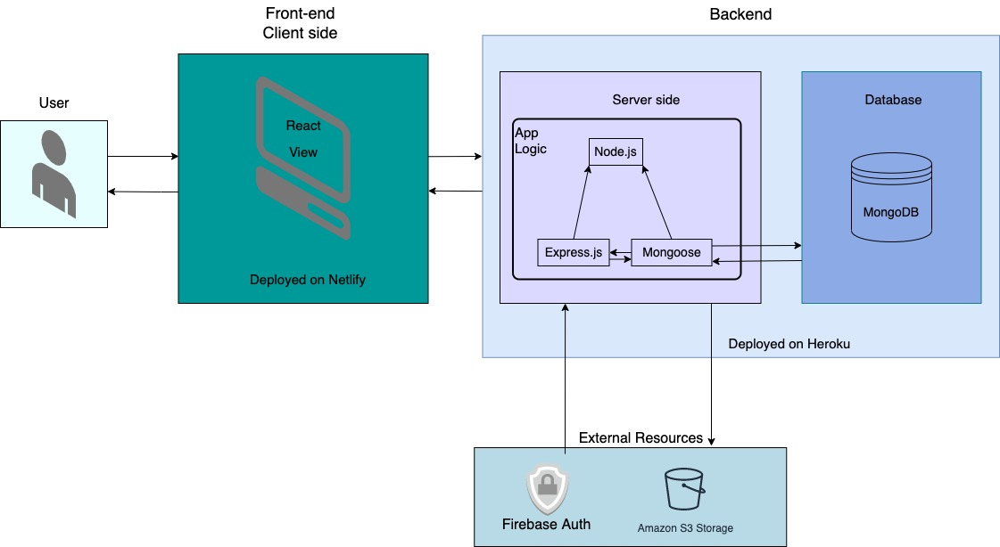
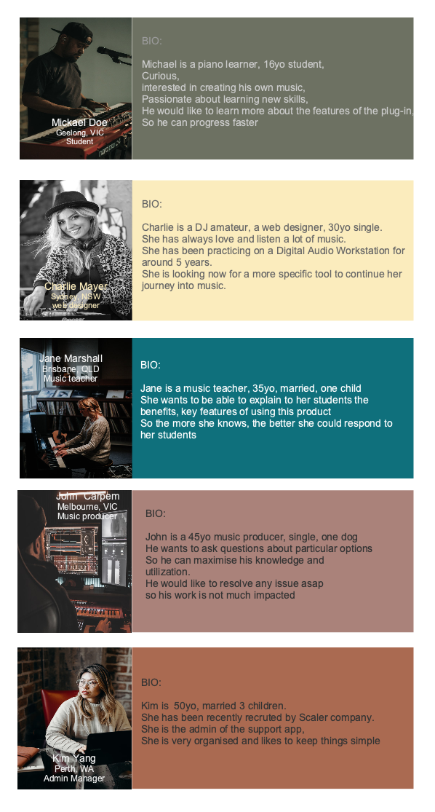

# Full Stack Application - Part A - README

## Description

### Purpose

**The product**: **Scaler** is a real company. Their product is a musical plug-in sofware for musicians, to create progressions with a virtual instrument or an external one.  It allows to create MIDI  (Musical Instrument Digital Interface) effects. It worked in collaboration with a DA: Digital Audio Workstation.

**The Goal**: Scaler is sold on a specific musical e-shop: Plugin boutique, among others products. It also have an informative website with a community forum. After discussions with the owner, he told me he would like an support app for the customers who bought the product to be able to login and explain the issue he could face. Then a technician would be able to exchange with him and find a solution.

###  Functionality, features

The main functionalities are Authentication, Authorization, creating tickets to communicate with an agent, be able to update them and delete them. 

For all users: 

- Log in
- Log out

For scaler users:

- Create an account

- Homepage with dashboard displaying history, current ticket(s)
- Create  a ticket to explain issue and fix issue
- Update a support ticket
- Change the status of a support ticket to Resolved

For admin:

- Dashboard with all the tickets

- Select a ticket and respond to a scaler user

- When issue is resolved possibility to mark it as solved

- Delete a ticket if needed

  

### Target audience

It is a niche product: made for Musicians, music lovers, professional or amateur that already use DAW and create their own music.

Only the exisiting users of the plug-in software could access to this support platform.

### Tech Stack

- Planning Management : trello board

- Wireframes: Balsamiq 

- Dataflow diagram and app Architecture Diagram: Diagram.io

- Backend: MERN 

  - Express
  - Mongoose
  - Nodemon
  - Firebase for auth

- Frontend: 

  - React
  - React-dom
  - Axios
  - JWT

- Testing

  - Manual testing
  - Jest 
  
- Deployment: 

  - Heroku to deploy MERN stack

  - Netlify to deploy React

## Dataflow Diagram

For the Dataflow diagram I followed the Gane and Sarson methodology.

This is the version I showed during the presentation:

After presentation, educators recommended me to add some missing informations about the data.

In this last version, I completed all the data flow information represented by an arrow and I added the meaning of the symbols.

## Application Architecture Diagram

This is Scaler Support App Architecture diagram, it represents the MVP:

During the presentation I mentioned that I would like to add Amazon S3 to store images but at this point it is not part of my MVP. But clearly it will be part of the future improvements I am planning to add.

**User**: The app that the user interacts withReact view: It is a JavaScript library, specialised in building User Interface. It will render the single page support app

**Node.js**: It is a JavaScript runtime platform, allowing to create command line tools and server side scripts locally. It manages requests asynchronously.

**Express.js**: It creates a server locally in the development and testing phases. It is in charge of the HTTP requests and responses with CRUD operations routes

**Mongoose**: It determines the schema and model for the data

**MongoDB**: It is the document oriented database using JSON. It will be represented by collections of data. It interacts with Mongoose. 

**Firebase** : It is an external infrastructure, owns by Google. It is a realtime database that we use for authentication. It will works with the server side.

**Amazon S3 Storage**: It is also an external resource, owns by Amazon. It is a cloud storage service, that stores data as objects within buckets.

## User Stories

**Personas**

This is the previous version, before presentation:

- Michael is a piano learner, 16yo, curious, interested in creating his own music, passionate about learning new skills, he would like to learn more about the features of the plug-in, So he can progress faster
- Charlie is a DJ amateur, a 30yo web designer, she has always love and listen a lot of music, she has been practicing on a DAW for around 5 years, she is looking now for a more specific tool to continue her journey into music
- Jane is a music teacher, she wants to be able to explain to her students the benefits, key features of using this product, So the more she knows, the better she could respond to her students
- John is a 45 yo music producer, he wants to ask questions about particular options So he can maximise his knowledge and utilization and he wants to resolve an issue asap so his work is not much impacted
- Kim 50yo, has been recently recruted by Scaler company. She is the admin of the app, she is very organised and likes to keep things simple

After the presentations, educators recommended to use the software Justinmind to render a better visual. So I modify what I did:

**User Stories**

This is the final version of the user stories. At first I mixed the personas and user stories.  I wasn't sure if the user stories should have a more marketing, UX view or should be more technical. At the end I decided to separate the personas and the user stories. This way the first part with the personas is more marketing and the second part user stories is technical. so for the MVP my goal is to achieve this:

- As a customer,

  - I want to log in to the support platform, SO I can see my personal dashboard / history

  - I want to be able to create a new support ticket SO I can get an answer to my questions from an agent

    The tickets will have different categories: general info, feature info, problem, blocker

  - I want to be able to update a ticket, SO I can refine my request to the agent

  - I want to be able to resolve a ticket  (change the status) SO I can indicate to the agent that my problem is solved

- As an admin,

  - I want to have an overview of all the tickets SO I can manage my load of work
  - I want to be able to sort the tickets by date SO I can prioritize them
  - I want to be able to interact with the customers SO I can help them
  - I want to be able to resolve the ticket SO I can focus on others tasks

  

  In the future I'm planning some improvements such as :

  - Customer can search for a specific support ticket with a search or filter bar
  - Customer can refer to a FAQ with the most common questions by users

  - Admin has hired different agents to split the workload:
  - Admin can assign the tickets to specific agents SO the customers can get an appropriate answer in the best time limit
  - Admin wants to remind customers with an automatic message if they didn't reply to an agent answer

  

## Wireframes

This is the first version that I showed during presentation: I created low fidelity wireframes with the software Balsamiq for 3 different screen sizes: Desktop, Tablet and Smartphone. At that time, I haven't had the time to create all the pages so I focused on the first views a user will discover while using the application: Homepage, Sign Up, Log In, Dashboard and Create a ticket views.

During the presentations, educators recommended me to mention what happen when a user click on a certain button, explaining a bit more the interactions between the differents views.

I decided to change the design a bit too.

This is the Homapage view with the logo and name of the company on the top left part. It is a link to the homapage view, so wherever the visitor is, he can return to the view by clicking on these links.

In the navbar on the right top area, the user can Sign Up ou Sign In. Each icon with the label will be a link to the appropriate view.

In the centre we can see the hero image with some description. Underneath is an About section with an another image.

This is the Sign Up view. After clicking on the icon or label on the right top area, the visitor will see the Sign Up view. If he/she is already a Scaler customer, in other words if he/she purchased already Scaler plug-in software, he/she will be able to create an account on Scaler Support App by filling these informations: username, email, password, password confirmation and Licence number. After submitting the user will be redirected to the Log In view. If the visitor clicks to the Sign Up view by mistake, he/she has the options to  click on the link at the bottom to the Log In view or he/she can go to the same view by clicking on the logo or label in the navbar.

Now that the visitor has created an account, he/she can Log In. If he/she forgot his/her password he/she can click on the link to retrieve it or modify it. If the visitor hasn't created an account yet, he/she can click on the link Sign Up underneath or on the navbar.

As mentioned above, if a customer has forgotten his/her password, he/she can get the details by email to update it.

Once the visitor is logged In, he/she become a user and has access to his dashboard. His/her name, product licence number and history of his/her tickets (if he/she created some before)  will appear. He/she also have the choice to create a new support ticket. The navbar changed too: instead of having Sign In and Sign Up, it has been replaced by My dashboard and Log Out.

When the user click on 'Create a new support ticket', this view will be displayed. He/she will have to fill in the subject , category and a message, then submit it.

Once the support ticket is created, it will appear in the ticket view. We can see the subject, category and the message. At the bottom, the user will have the possibilty to add new informations.

This is how the user dashboard looks like once the user has created a ticket.

On the user dashboard, the user can see a notification appeared on his ticket.

If the user clicks on the notification or his/her ticket, he/she will be able to see the Admin replied to his/her message. The user messages will be located on the left and the admin ones on the right, like a conversation on any messaging app. The user will also have the possibility to update the status of the ticket.

Now the user has updated the ticket as it is marked as resolved.

Now on the dashboard we can see one ticket resolved at the bottom and one new ticket .

This is the Admin dashboard with the list of all the users tickets. The admin has the possibility to view a ticket, update it or delete it.

## Planning methodology- Trello Boards

This is the link of Trello board for Scaler Support App: https://trello.com/b/bCOOFFh9/full-stack-app

As I'm doing the project on my own, the Trello board is helping me to keep track of what I need to do,  what I should review or what I've already achieve.

